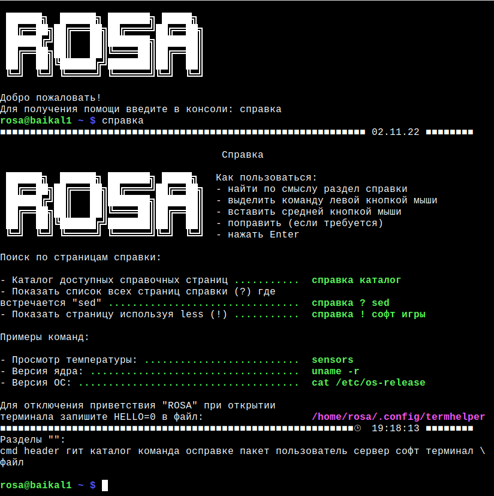

## Termhelper — справочная система для терминала. 



### Почему не man:
- man - страницы ориентированы на описание команды и всех ее параметров,
- termhelper - сборник готовых рецептов

- man - вам нужно знать имя команды чтобы получить справку
- termhelper - до нужной информации можно добраться следуя логике каталога

### Установка:

Из репозиториев ROSA Linux: `sudo dnf install termhelper`

Из исходников: `sudo make install`

### Как сделать свой хелп.   
1. Выбор имени.   
	В каталоге для каждого языка должен быть файл в имени которого нет точек. Это первый файл в каталогизаторе
названия остальных фалов должны начинаться с этого имени. Дальше следует точка, имя подраздела и т.д на любую глубину.
Например для русского языка "первый" файл называется "справка", следовательно название вашего хелпа должно быть:   
```
.../ru/справка.ваш_хелп
```
если по смыслу хелп можно разместить в каком-то из существующих разделов, или вы планируете создать новый раздел 
со справками, то так:   
```
.../ru/справка.раздел.подраздел.ваш_хелп
```
Внимание, файлы для каждого раздела тоже нужно создать если их нет, они могут быть даже пустым, 
но лучше записать туда общую информацию по хелпам которые раздел включает.
Файлы лучше именовать используя символы вашей локали, удобнее будет пользоваться автокомплитом по Tab. 

2. Форматирование текста.
Для удобства фоматирования текста доступно несколько функций.
- функция '+' - создание заголовков. Принимает один параметр - текст в кавычках. Тест будет разбит на части
не более 60 символов (по умолчанию) и отцентрован.
```
    + Это заголовок
```   
- функция "_" - запись текста в две колонки. Первый параметр "Задача", второй "Решение", только в такой последовательности.
Колонки можно вывести и наоборот ("решение" "задача"), используя параметр REV_COLUMNS=yes в конфигурационном файле. 
Этот же параметр с "yes/no" используем в хелпах если нужно запретить изменение конфигом для конкретного хелпа.
```
    _ "Выключить комп" "poweroff"
```
- функция long - разбивает переданный текст на строки по словам, каждая строка завершается обратным слэшем.
```
	long "длинный длинный предлинный текст"
```
- функция = - меняет цвет текста. Доступные значения: black, red, green, yellow, brown, blue, light_blue, magenta,
cyan, white, purple, default
```
	= red
```
- эти же коды цветов можно использовать как переменные, например: 
```
    echo -e "${green}текст ${red}текст${default}"
``` 
И несколько переменных, которыми можно управлять работой встроенных функций:
- mark_color=green    цвет выделенного, иначе говоря цвет второй колонки для функции "_"     
- def_color=default   цвет по умолчанию, mark_color - работате только когда текущий цвет эквивалентен дефолтному
иначе все будет отображаться тем цветом котрый установлен с "="    
- separ=' '	      разделитель между колонками, по умолчанию - пробел, можно менять к примеру на точку, 
будет лучше просматриваться соответствие "описание".........."команда"     
- column_width=50	ширина колонки "Решение" ( ширина второй колонки 80 - column_width ) 
по умолчанию 50 символов, ширина второй расчитается относительно этого значения  
- header_width=60	ширина заголовка, по умолчанию 60  

3. Условия в хелпах.   
Файлы-справки выполняются (source файл) в коде основного скрипта, то есть в хелпах можно использовать все что
может bash, и комбинировать это с функциями описанными выше. Пример:   
```
[ -f /some/file ] && + "справка для  some file"
[ -f /some/file ] && _ "помощь по some file" "/some/file --help"
```

### Пример хелпа.   
```
= magenta 		# устанавливаем цвет для заголовка
+ "ЭТО ЗАГОЛОВОК"
+ "-------------" 	# подчеркнутый заголовок
= default		# возвращаем цвет на место, иначе до упора мажента будет
separ='.'		# меняем разделитель на точки
column_width=40		# уменьшаем ширину первого столбца до 40 (середина)

_ "Добавить пользователя:" "sudo useradd имя"
_ "Удалить пользователя:" "sudo userdel имя"
_ "Добавить группу:" "sudo groupadd название"
_ "Удалить группу:" "sudo groupdel название"
_ "Добавить пользователя в группу:" "sudo usermod -a -G название_группы имя_юзера"
_ "Удалить пользователя из группы:" "udo gpasswd -d название имя"
echo ''
_ "Просмотреть пользователей:" 'sed 's/:.*//' /etc/passwd |tr '\n' ' '; echo '
_ "Просмотреть группы:" "groups"
_ "Последние заходы в систему:" "lastlog"
_ "Своя история входов в систему:" "last -a"
_ "Текущий пользователь:" "whoami"

+ # плюс без текста - пустая строка, как  echo '' 
+ "Еще один заголовок просто в нем побольше текста и он будет раделен на строки"
+
column_width=80 	# увеличиваем ширину столбца, предполагается много текста
separ=' '       	# сепаратор меняем на пробел, так как комнады все равно будут на другой строке
mark_color=brown	# меняем цвет для столбца с командами, просто для примера
REV_COLUMNS=yes 	# инвертируем вывод колонок, одновлеменно запрещая инверсию из конфига
_ "Пример очень длинного описания бла-бла бла-бла бла-бла бла-бла бла-бла бла-бла 
бла-бла бла-бла бла-бла бла-бла бла-бла бла-бла бла-бла бла-бла бла-бла бла-бла 
бла-бла бла-бла бла-бла бла-бла бла-бла бла-бла бла-бла " "command bla-bla"
_ "Пример очень длинной команды:" \
'command --bla-bla --bla-bla  --bla-bla --bla-bla --bla-bla --bla-bla --bla-bla (*^%$#$%^' 
_ "Пример очень-очень длинной команды разбитой на строки:" \
'command --bla-bla --bla-bla --bla-bla --bla-bla --bla-bla --bla-bla --bla-bla   \
--bla-bla --bla-bla --bla-bla --bla-bla --bla-bla --bla-bla --bla-bla --bla-bla  \
--bla-bla --bla-bla ' 

long Просто очень длинный текст разбитый настроки кавычки не требуются \
достаточно переносить строку слэшем
```
Все эти примеры можно было сделать без использования встроенных функций, просто с 
echo -e '\t\tтекст' и это даже быстрее будет работать, но вам пришлось бы 
самостоятельно высчитывать символы и пересчитывать все при внесениии изменений в текст.


### История

termhelper является форком [termhelper-ru](https://abf.io/survolog/termhelper-ru).

Отличия termhelper от termhelper-ru:

- справка разбита на отдельные файлы
- нет ограничения на вложенность справки
- возможность добавлять новые хелпы просто разместив файлы с ними в нужном каталоге
- после добавленния хелпов не нужно создавать новые алиасы или что-то еще, нужно только
именовать их определенным образом и они сразу попадут в каталогизатор
- для автокомплита вместо алиасов используется bash completion
- вместо автодополнений можно использовать сокращения т.е. "справка co бе", 
  вместо "справка софт безопастность"
- нет ограничения на русский язык, можно добавлять любые и тоже без внесения изменений в код
- добавлены специальные функции для упрощения форматирования текста

